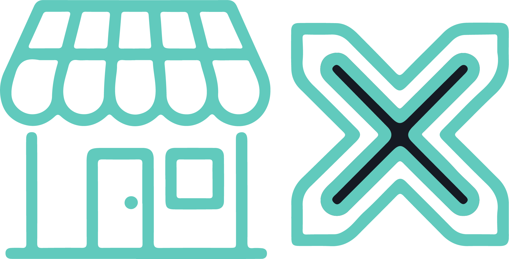
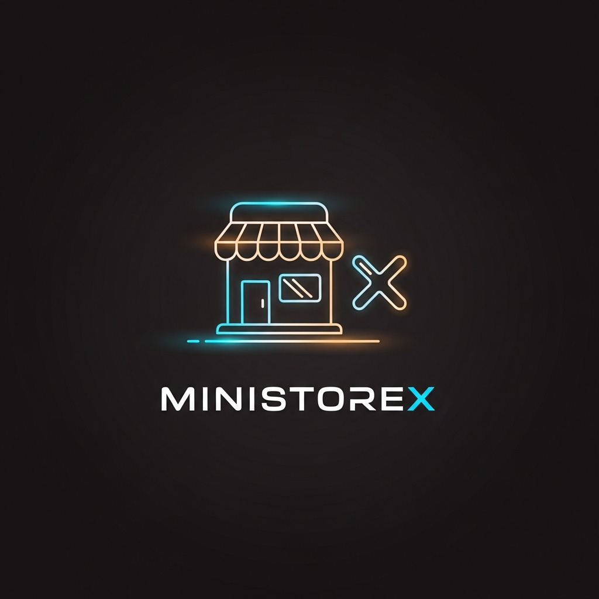

<p align="center">
  
</p>

<h1 align="center">MiniStoreX</h1>

<p align="center">
  <strong>A Modern Shop Management System for Small Businesses in Sri Lanka</strong>
</p>

<p align="center">
  <a href="#-features"><strong>Features</strong></a> ·
  <a href="#-screenshots"><strong>Screenshots</strong></a> ·
  <a href="#-tech-stack"><strong>Tech Stack</strong></a> ·
  <a href="#-getting-started"><strong>Getting Started</strong></a> ·
  <a href="#-contributing"><strong>Contributing</strong></a>
</p>

---

## 📖 About

MiniStoreX is a comprehensive and modern **Shop Management System** designed specifically for small and medium businesses in Sri Lanka. It streamlines daily operations including **Point of Sale (POS)**, **inventory tracking**, **customer management**, and **credit (Naya) handling**.

Built with performance and user experience in mind, MiniStoreX provides business owners with the tools they need to grow their business efficiently.

---

## ✨ Features

| Feature                             | Description                                                                   |
| ----------------------------------- | ----------------------------------------------------------------------------- |
| 🛒 **Point of Sale (POS)**          | Fast and intuitive billing interface for quick checkout                       |
| 📦 **Inventory Management**         | Track stock levels, products, and receive low stock alerts                    |
| 👥 **Customer Management**          | Maintain customer profiles and purchase history                               |
| 💳 **Credit (Naya) Ledger**         | Built-in system to manage customer credit, payments, and outstanding balances |
| 🏪 **Multi-Store & Multi-Location** | Manage multiple shops or branches from a single dashboard                     |
| 📊 **Reports & Analytics**          | Visual insights into sales, revenue, and best-selling products                |
| 🔒 **Role-Based Access**            | Secure access controls for Admins, Managers, and Cashiers                     |

---

## 📸 Screenshots

<p align="center">
  
  
</p>

<p align="center">
  
  
</p>

<p align="center">
  
</p>

---

## 🛠️ Tech Stack

| Technology                                          | Description                                               |
| --------------------------------------------------- | --------------------------------------------------------- |
| **[Next.js 15](https://nextjs.org/)**               | React framework with App Router for server-side rendering |
| **[TypeScript](https://www.typescriptlang.org/)**   | Type-safe JavaScript for robust development               |
| **[Supabase](https://supabase.com/)**               | Backend-as-a-Service with PostgreSQL database             |
| **[Tailwind CSS](https://tailwindcss.com/)**        | Utility-first CSS framework for rapid styling             |
| **[Shadcn UI](https://ui.shadcn.com/)**             | Beautiful, accessible component library                   |
| **[Framer Motion](https://www.framer.com/motion/)** | Smooth animations and transitions                         |
| **[Lucide React](https://lucide.dev/)**             | Beautiful open-source icons                               |

---

## 🏁 Getting Started

Follow these steps to set up the project locally.

### Prerequisites

- **Node.js** (v18 or higher)
- **npm** or **pnpm**
- A **Supabase** project

### Installation

1️⃣ **Clone the repository**

```bash
git clone https://github.com/kavishkadinajara/ministorex.git
cd ministorex
```

2️⃣ **Install dependencies**

```bash
npm install
# or
pnpm install
```

3️⃣ **Configure Environment Variables**

Create a `.env.local` file in the root directory:

```env
NEXT_PUBLIC_SUPABASE_URL=your_supabase_project_url
NEXT_PUBLIC_SUPABASE_PUBLISHABLE_KEY=your_supabase_anon_key
```

> [!TIP]
> You can find these values in your [Supabase project's API settings](https://supabase.com/dashboard/project/_?showConnect=true).

4️⃣ **Run Database Migrations**

Apply the SQL migrations located in `supabase/migrations/` to your Supabase project.

5️⃣ **Start the Development Server**

```bash
npm run dev
```

Open [http://localhost:3000](http://localhost:3000) to see the application.

---

## 📂 Project Structure

```
ministorex/
├── app/                    # Next.js App Router pages and layouts
├── components/             # Reusable UI components
│   ├── layout/             # Layout components (Sidebar, Header)
│   └── ui/                 # Shadcn UI components
├── lib/                    # Utilities, API wrappers, and types
│   ├── api/                # Supabase API wrapper functions
│   ├── supabase/           # Supabase client configuration
│   └── types/              # TypeScript type definitions
├── public/                 # Static assets (images, logos)
└── supabase/               # Database migrations
```

---

## 🤝 Contributing

Contributions are welcome! Here's how you can help:

1. **Fork** the repository
2. **Create** a new branch (`git checkout -b feature/amazing-feature`)
3. **Commit** your changes (`git commit -m 'Add amazing feature'`)
4. **Push** to the branch (`git push origin feature/amazing-feature`)
5. **Open** a Pull Request

---

## 📄 License

This project is licensed under the **MIT License**.

---

<p align="center">
  Made with ❤️ in Sri Lanka
</p>
